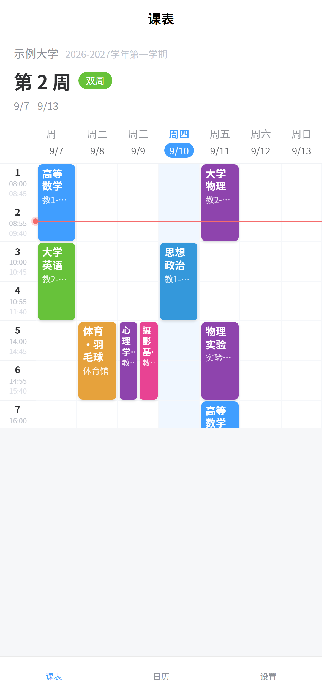
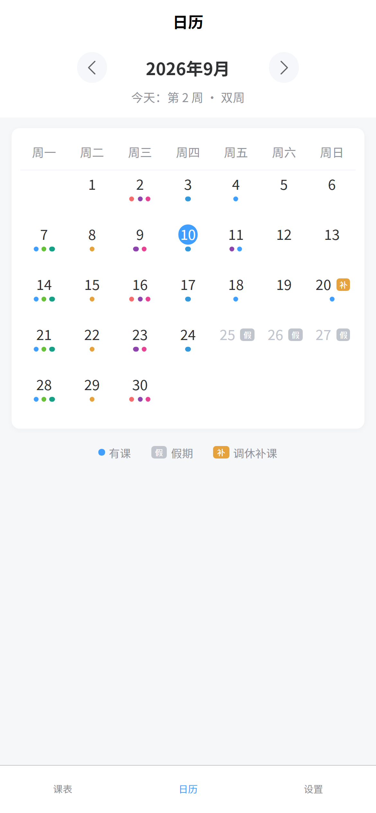
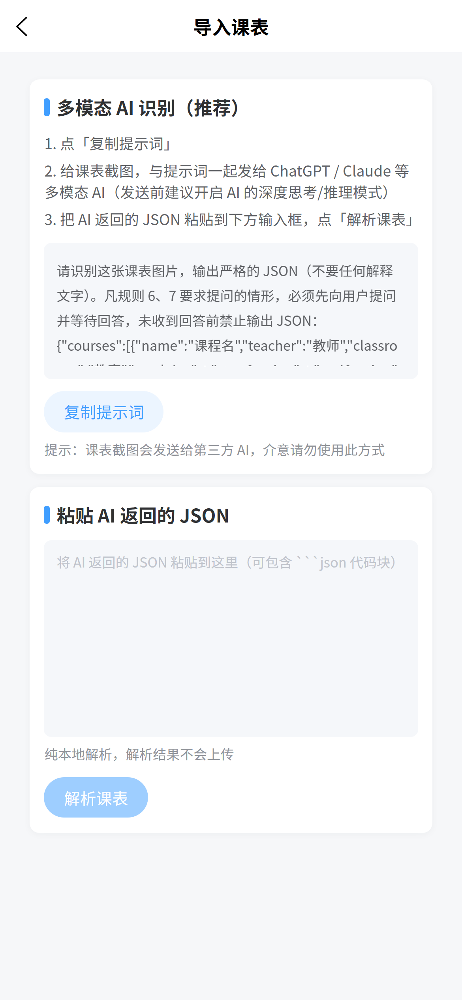
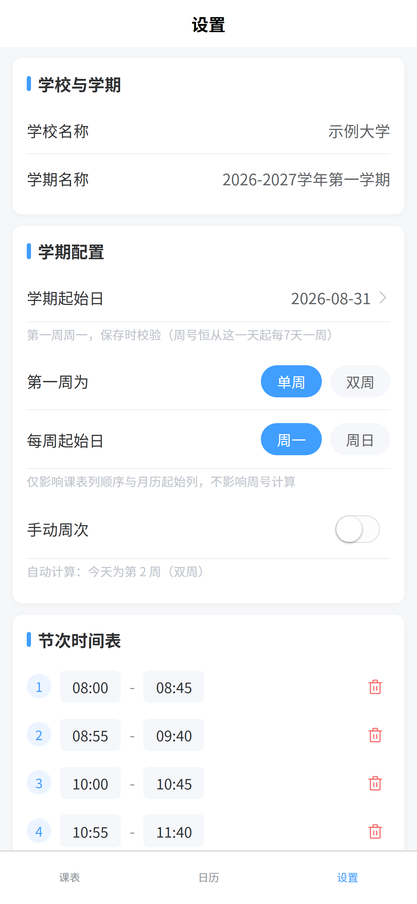

# 课程表 · 微信小程序

本地优先的微信小程序课表应用。个人小范围使用（最多几十人），**全部业务逻辑在前端完成**，数据仅保存在用户设备本地，离线可用。

- 技术栈：UniApp（Vue3 语法）+ uView Plus，编译目标微信小程序（兼容 H5 预览）
- 架构：小程序端完成课表渲染、周次、单双周、假期调休等全部逻辑；后端仅用于教务系统爬虫导入（不存储课表、不做账号登录）

设计文档见 [`docs/方案1-优化版.md`](./docs/方案1-优化版.md)（含完整数据结构、过滤链规范与路线图）；需求原始描述见 [`docs/需求原始描述.md`](./docs/需求原始描述.md)。

## 预览

| 周课表 | 月日历 | 课表导入 | 设置 |
|:---:|:---:|:---:|:---:|
|  |  |  |  |

<sub>截图为 H5 预览，课程与学期均为内置**合成示例数据**（"示例大学"），不含任何真实课表。</sub>

## 功能

| 模块 | 说明 |
|------|------|
| 周课表 | 7 天 × N 节网格；左右滑动切换教学周（每个教学周一个真实分页）；左侧时间列显示每小节起止时间；今日列高亮；当前节次参考线（30 秒刷新）；同节次多课横向均分并排；点课程块编辑、点空白格快速新增；**长按课程块不松手即可拖动改时间**（拖到左右边缘悬停自动翻周） |
| 月日历 | 自封装月历；有课日期彩色圆点；假期置灰 +「假」角标；调休日期「补」角标；点击日期弹当日课程时间线（含当天被取消的课，带「恢复」按钮）；切换月份、回到今天 |
| 课程管理 | 课程名/教师/教室/颜色/备注/星期/节次；周规则支持 每周/单周/双周/自定义区间（`1-16`、`2-8,10-14` 多段）；编辑、复制；**分级删除**：仅取消某一天这一节 / 删除部分节次 / 删除部分周次 / 删除整门课程 |
| 学期配置 | 学期起始日（校验必须为周一）、首周单双、每周起始日（周一/周日）、手动校准教学周、自定义节次时间表 |
| 假期 & 调休 | 假期单日/范围批量添加；调休「某天补周X的课」；渲染优先级 假期 > 调休 > 正常；保存时冲突检测 |
| 课表导入 | 内置标准提示词一键复制 → 把课表截图发给任意多模态 AI → 粘贴返回的 JSON 导入；预览增量/覆盖、冲突标红勾选排除；可同时应用课表中的节次时间表；自动补齐国务院官方假期 |
| 备份恢复 | 导出 JSON（复制保存）；导入恢复（导入前自动备份、可撤销）；一键恢复示例数据 |
| 云端备份 | 微信云开发数据库直连（集合 `timetables_backups`，权限「仅创建者可读写」，按 openid 隔离）；设置页手动备份/恢复；首次使用自动检测云端备份并弹窗一键恢复 |

### 两个交互细节

- **拖动课程**：长按课程块 → 振动 + 原卡片变暗 + 同尺寸浮动卡片出现在手指处，**手指不抬起**，直接拖到目标格（途经格整段高亮）→ 松手落位，就像手机上挪 App 图标。**移动优先级最高**：长按那一刻起整条手势就归拖动所有（翻页手势被挂起）。**只挪长按的这一节（这一天）**：每周课落下时写入一条「仅本次」一次性课——长按日那一节取消、目标日新增这一节，原课与其余所有周都不动；所以单周课的某一节拖到双周课的位置，只有那一天的课表变了，两门课的数据都原样。**翻到别的周后再落下，即使网格位置相同也算挪动**（同一天原位落下才是取消）——单双周课在下一周本来没有这节，翻过去同格落下就会把这一节挪到那一周。一次性课（临时/替代）拖动就直接挪它自己。目标格当天有别的课也不拦截，并排显示、冲突标红。松手处不在课表内会提示「未移动」。取消的记录可在日历页当日弹窗恢复。
  拖动期间**页面不跟手**：手指相对内容不动就没法换列，所以翻周改为「把课程拖到**屏幕左右边缘**（约 16px 内，左边缘即时间列）悬停约 0.5 秒」，且是瞬时切换（各周页面几何一致，落点列才始终精确）。翻页区贴着屏幕边缘而非格子边缘——画在格子上会撞进周一/周日列的瞄准区，停半秒就误翻页。拖动中网格**保持可滚动**（纵向拖到视口外的行也拖得到，落点行按「手指位移 + 滚动量」补偿）；H5 端长按会阻止浏览器原生滚动，拖动中滚不到视口外是 H5 的已知限制。
  为此周视图用的是自绘分页器而非原生 `swiper`：`swiper` 跟手会跟手指 1:1 位移，而 MP 端没有 `disable-touch`（只在 H5 实现）能中途关掉它，`catchtouchmove` 又只能静态声明、会永久破坏"手指落在卡片上滑动切周"。自绘后手势完全自己掌控，双端行为一致。
- **取消当天这一节**：并不是删掉课程，而是写入一条「取消型」一次性记录来抑制当天显示，因此**可恢复**——到日历页点该日期，当日弹窗底部会以灰色「已取消」行列出，点「恢复」即回归。

## 目录结构

```
src/
  pages/
    schedule/schedule.vue      # 周课表（Tab1）
    calendar/calendar.vue      # 月日历（Tab2）
    settings/settings.vue      # 设置（Tab3）
    import/import.vue          # 课表导入（AI 提示词 + 结果预览）
  components/
    weekGrid/                  # 周网格（并排布局算法 + 参考线）
    courseCard/                # 课程块
    courseEdit/                # 课程编辑弹窗（增删改复制）
    monthCal/                  # 月历
    daySheet/                  # 当日课程底部弹窗
  utils/                       # 纯函数（可独立单测）
    week.js                    # 教学周号/单双周计算
    weeksPattern.js            # 周规则解析（all/odd/even/区间/限定范围单双周）
    filter.js                  # 过滤链唯一入口（假期>调休>正常）
    time.js                    # 日期工具
    parser.js                  # AI 返回 JSON 解析与字段钳制
    importMatch.js             # 增量匹配 / 合并 / 冲突检测
    holiday.js                 # 调休补课星期推算
    officialHolidays.js        # 内置国务院官方假期与调休（按年份）
    cloudBackup.js             # 微信云开发备份（wx.cloud 直连）
  store/
    index.js                   # 存储管理器（唯一触碰 storage 的模块）
    useData.js                 # 组合式 API，页面订阅数据
    sampleData.js              # 内置示例数据
  api/
    importApi.js               # 模式A 后端导入（可选，接口契约见方案文档）
    config.js                  # 后端地址；云环境 ID 从 .env.local 的 VITE_CLOUD_ENV 读取
docs/                          # 设计文档与需求原始描述
scripts/
  apply-appid.mjs              # 构建后把本地 AppID 写入产物（见「本地配置」）
  verify-import.mjs            # 导入解析 / 过滤链纯函数断言脚本
  verify-store.mjs             # store 层分级删除 action 断言脚本（打桩 uni 存储）
```

## 运行

```bash
npm install

# H5 浏览器预览
npm run dev:h5

# 微信开发者工具
npm run build:mp-weixin
# 打开微信开发者工具 → 导入 dist/build/mp-weixin
```

纯函数与 store 行为不依赖界面，可直接用 Node 断言（无需测试框架，失败时以非零码退出）：

```bash
node --input-type=module -e "import('./scripts/verify-import.mjs')"   # 导入解析 + 过滤链
node --input-type=module -e "import('./scripts/verify-store.mjs')"    # 分级删除 action
```

### 本地配置（小程序 AppID / 云环境 ID）

仓库**不含任何真实 AppID 和云环境 ID**——避免 fork 者继承作者身份，也避免本地构建把源文件改脏后误提交。

要用自己的 AppID 和云开发，在仓库根目录新建 `.env.local`（已被 `.gitignore` 的 `.env.*` 规则忽略）：

```bash
# 微信云开发环境 ID（云备份/云恢复）——会被编译进小程序代码
VITE_CLOUD_ENV=你的云开发环境ID
# 自己的小程序 AppID —— 不带 VITE_ 前缀，不会进入 JS 产物
MP_WEIXIN_APPID=你自己的小程序AppID
```

两个变量按需填写，都不填也能跑：

- **`VITE_CLOUD_ENV`** 由 Vite 在编译时内联进 `src/api/config.js`（`import.meta.env.VITE_CLOUD_ENV`）。留空时点云备份会提示"未配置云环境"，其余功能不受影响。
- **`MP_WEIXIN_APPID`** 故意不加 `VITE_` 前缀——Vite 只把 `VITE_` 开头的变量注入客户端代码，所以它只被构建脚本读取，**不会进入 JS 产物**。`npm run build:mp-weixin` 构建完成后会由 `scripts/apply-appid.mjs` 写进 `dist/build/mp-weixin/project.config.json`（微信开发者工具认的正是这个文件，效果等价于直接写在 `src/manifest.json` 里）。dev 模式起来之后可手动补写：

  ```bash
  npm run appid
  ```

不配置 `MP_WEIXIN_APPID` 时产物保持游客模式（`touristappid`），可在开发者工具中打开调试，云能力需真实 AppID。

首次启动自动写入示例数据（2026-08-31 学期，含单双周/多段周/并排/国庆假期/调休示例），可在 设置 → 数据管理 中恢复或清除。

## 数据与隐私

- 所有数据默认通过 `uni.setStorageSync` 保存在设备本地（KB 级，远低于 1MB/10MB 上限），无账号体系
- 可选云备份走微信云开发数据库，数据按 openid 隔离，**安全性依赖云数据库安全规则设为「仅创建者可读写」**
- 本仓库不提交真实凭据：小程序 AppID 与云开发环境 ID 都放在 gitignored 的 `.env.local`（见上文「本地配置」）
- `src/api/config.js` 的 `apiBaseUrl` 为空（模式 A 后端地址），`cloudEnv` 从 `VITE_CLOUD_ENV` 读取——两者留空时对应功能提示"未配置"，不影响本地课表。云环境 ID 本身不是密钥，但其安全性完全取决于上面那条数据库安全规则，因此同样不提交。**切勿把云开发管理密钥写进仓库**
- 后端导入接口仅在内存中处理凭据、不落盘

## 路线图

- [x] P0 数据模型 + 存储管理器 + 纯函数模块
- [x] P1 周课表页（示例数据跑通）
- [x] P2 课程 CRUD、调休假期管理、日历页
- [x] P3 导入：多模态 AI 识别（复制提示词 → 截图发给 AI → 粘贴 JSON 解析导入）
- [x] P4 云开发备份、单双周限定范围、一次性课程与时间跨度修改
- [ ] 待办：模式 A 后端接口（FastAPI + Playwright，可选）、深色模式

## 开源协议

[MIT](./LICENSE)
